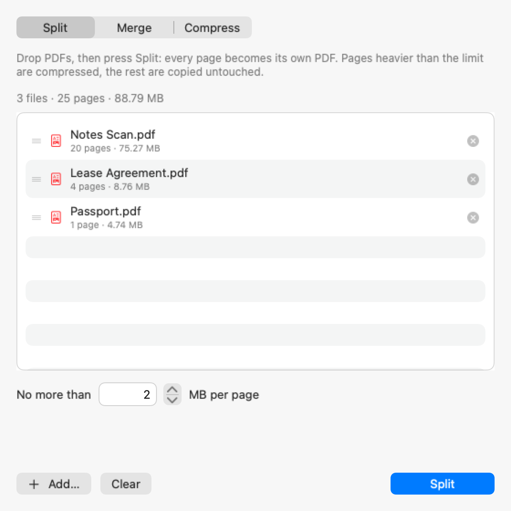

# PDF Ream

A small native macOS app that splits a PDF into one file per page, merges several PDFs into one, and compresses a PDF down to a size limit you set.

<picture>
  <source media="(prefers-color-scheme: dark)" srcset="docs/screenshot-dark.png">
  
</picture>

## Why

A scan made with the iPhone Notes app is a full-resolution JPEG per page: twenty pages easily come to 75 MB. Upload forms routinely cap attachments at a few megabytes, and some want one file per page. PDF Ream takes the size limit as the input — you say "2 MB per page" or "10 MB total" and it keeps as much quality as fits under that number.

It uses the system PDFKit and CoreGraphics only: no third-party dependencies, no network access, nothing leaves the machine.

## Download

Download `PDF-Ream-<version>.zip` from the [latest release](../../releases/latest), unzip it, and move **PDF Ream** to Applications. It is a universal app for Apple silicon and Intel Macs running macOS 13 or later.

The app is signed ad hoc, not with an Apple Developer ID, and it is not notarized, so macOS blocks a downloaded copy the first time. Allow it once:

- **macOS 15 Sequoia and later:** open PDF Ream; macOS refuses and offers only **Done** or **Move to Trash** — choose **Done**. Open **System Settings → Privacy & Security**, scroll to **Security**, click **Open Anyway** next to the note about PDF Ream, and confirm with your password. Open the app again and choose **Open Anyway**. (Right-click → Open no longer bypasses this on macOS 15.)
- **macOS 13 and 14:** right-click (or Control-click) the app, choose **Open**, then **Open** again.
- **Or, in Terminal**, on any version:

  ```sh
  xattr -dr com.apple.quarantine "/Applications/PDF Ream.app"
  ```

Each release comes with a `.sha256` file; `shasum -a 256 PDF-Ream-<version>.zip` should print the same value.

## Build from source

Only the Xcode Command Line Tools are needed, version 15.3 or later (Swift 5.10 or later); full Xcode is not.

```sh
xcode-select --install
./build.sh
```

`build.sh` writes `PDF Ream.app` next to itself — a universal binary (arm64 + x86_64), ad-hoc signed — and the test tools into `build/`. A copy you build yourself is not quarantined, so Gatekeeper does not get involved. `build/` and `PDF Ream.app` are build output and are not committed.

## Usage

Dropping files never starts a job. Files land in a list; the action button does the work.

1. **Add files.** Drop one or several PDFs on the window, or a folder (every PDF inside is collected; aliases and symbolic links to folders work too). Files dropped on the Dock icon or opened from Finder are queued the same way. `⌘O`, the drop zone, and the **Add…** button open a file chooser.
2. **Pick a mode.** The list survives the switch.
   - **Split** — every page becomes its own PDF. Pages heavier than the limit are recompressed; the rest are copied untouched.
   - **Merge** — all queued files become one document. Row order is page order; drag the rows to change it.
   - **Compress** — each file is shrunk separately, staying a single document.
3. **Set the limit** at the bottom of the window. Split has its own per-page limit (default 2 MB); Merge and Compress share a final-file limit (default 10 MB). Both are remembered between launches. The field accepts 0.1–2000 MB; a number outside that range is brought back into it.
4. **Press the action button** (`Split` / `Merge` / `Compress`, or `⌘R`). Only now does a save panel open, and the whole queue is processed.

Where the output goes:

| Mode | One file in the queue | Several files |
| --- | --- | --- |
| Split | Save panel; the name becomes a folder `<name> (pages)` holding `<name>_01.pdf`, `<name>_02.pdf`, … | Choose a folder; each input gets its own `<name> (pages)` subfolder |
| Merge | Save panel, default name `Merged.pdf` | Same — one file for the whole list |
| Compress | Save panel, default name `<name> (compressed).pdf` | Choose a folder; one `<name> (compressed).pdf` per input |

With several files, nothing on disk is ever overwritten: a number is added instead (`Scan (pages) 2`, `Scan (compressed) 2.pdf`). With one file, the save panel asks before replacing anything. A folder of pages is replaced only once the new pages are all written: they go into `<name> (pages) (in progress)` first, then the old folder is moved to the Trash and the new one takes its name, so it holds only the new pages. A replaced file is overwritten.

While a job runs, the window refuses new files and cannot be closed, and quitting asks for confirmation. When it finishes, the processed files leave the list and the result offers a way to what was made: **Open** and **Show in Finder** for a single file, **Open Folder** for a single folder of pages, **Show in Finder** when there are several. Files that failed stay in the list with the reason shown, so pressing the button again retries only them.

## How compression works

**Lossless first.** Anything that already fits is copied, not re-encoded:

- Split: a page whose own bytes are under the limit is written out as is.
- Compress / Merge: a single file already under the limit is copied byte for byte. Otherwise the document is assembled losslessly first, and if *that* fits, it is saved without recompressing anything.

**Then the quality ladder.** Only what still overshoots is re-rendered as JPEG and wrapped back into a PDF page of the original size. A binary search over 15 steps — from 300 dpi at JPEG quality 0.85 down to 40 dpi at 0.20 — picks the highest step that fits.

- Split searches per page, so a heavy page never drags down a light one. If no step fits, the resolution keeps dropping (×0.75 down to 10 dpi) and, failing that, the smallest result is saved and the page is reported as over the limit. A page that rendering cannot make smaller is kept as it is and reported the same way.
- Compress / Merge render every page at one shared level, so the document stays visually consistent, and keep a page's original bytes whenever they cost less than the render — text and vector pages usually do. Each step is judged by the real size of the assembled document. What a kept page costs is worked out two ways: with what it shares with its file (a font, a background) counted once, which keeps text pages as text, and counted on every page, which lets a heavy background used by all pages go once they are all rendered. The first choice that fits is used.
- If nothing fits, the smallest version is saved and reported as over the limit. Compress never writes a file larger than the one it started from.

**Preserved:** page rotation, crop boxes, annotations (they are drawn into the render), and page order. Merge and Compress keep bookmarks and internal links, pointed at the right pages; Compress also keeps the title, author, subject and keywords. Pages that were not re-rendered stay vector, with selectable text. The JPEG is embedded as a `DCTDecode` stream rather than re-encoded on the way in.

**Not preserved:** a page that had to be re-rendered becomes an image, so its text stops being selectable and links on it stop being clickable. In a rewritten document, document-level extras — page labels (numbering such as i, ii, iii), XMP metadata, file attachments — and the printing or copying restrictions of an owner password are not kept; a file copied as is keeps everything. The app warns when it queues a file with such restrictions. A document merged from several files starts with empty document information.

## Testing

`./build.sh` builds the test tools along with the app: `build/pdfream-cli`, `build/make_fixtures`, `build/uitest` and `build/snapshot`.

**Engine — 47 assertions.** Needs [qpdf](https://qpdf.sourceforge.io/):

```sh
brew install qpdf
./build.sh
Tools/run_tests.sh /tmp/pdfream-tests
```

The first run generates synthetic fixtures into `<work-dir>/fixtures` (about 200 MB, including a 75 MB 20-page scan). It checks page counts and sizes and validates every output with `qpdf --check` (the one warning allowed is the "object has offset 0" note that PDFKit's writer always causes; the check is first shown to reject a damaged file). It covers rotation, crop boxes, vector text, annotations drawn into re-rendered pages, bookmarks, links and document information through Merge and Compress, compression that uses the room it is given (text sharing one font, an image shared by every page), byte-for-byte copies, damaged and password-protected files, non-ASCII paths, and a 60-page run. Speed and peak memory are reported but not asserted, since both depend on the machine — set `PDFREAM_PERF=1` to turn them into checks.

**UI — 114 assertions.** Drives the real `AppModel` with the save panels scripted instead of shown, so it runs headless. It reuses the engine fixtures (including `locked.pdf`, `restricted.pdf` and `big60.pdf`, which qpdf builds), so run the engine suite first:

```sh
build/uitest /tmp/pdfream-tests/fixtures /tmp/pdfream-tests/ui
```

The work directory is deleted and recreated on every run, so `uitest` only accepts an empty directory or one it created itself. It covers the drop-queues-nothing-runs contract in every mode, batch runs, cancelled panels, input refused while a panel is open or a job runs, a double press of the action button, files that vanish between drop and run, partial and total batch failures and retrying only the failed files, a window that stays open while a job runs, replacing an existing folder of pages (and leaving it alone when the split fails), output-name collisions (including names that differ only by case, and dotted names), symbolic links to folders, owner-password files, the limit range, and Finder and Dock opens. Its settings live in a preferences file of its own in the temporary folder, removed at the end, so the app's real settings are never touched.

**Snapshots** (optional) render the window offscreen to PNGs — useful for checking layout without a display. The two `readme-*.png` images are the screenshots in `docs/`:

```sh
build/snapshot /tmp/pdfream-tests/fixtures /tmp/pdfream-shots
```

Measured on an M4 Pro with the generated fixtures: the 20-page 75 MB scan splits in 1.4 s with every page under 2 MB (5 pages were already small enough and were copied untouched); the same file compresses to 8.6 MB in about 3 s; a 60-page version splits in under 5 s.

## Releasing

```sh
Tools/package.sh
```

Commit first: it refuses to run with uncommitted changes, so the zip matches the tag it is released under. It rebuilds, refuses a build that lacks one of the two architectures, strips Finder metadata from a copy made outside the checkout, verifies the signature strictly, and writes `dist/PDF-Ream-<version>.zip` plus a `.sha256`, checking the zip by unpacking it again. It prints the `git tag` and `gh release create` commands to publish them. Raise `CFBundleShortVersionString` and `CFBundleVersion` in `Resources/Info.plist` before each release and add an entry to `CHANGELOG.md`.

## Project layout

```
build.sh                  Builds "PDF Ream.app" plus the CLI and test tools
Sources/PDFEngine.swift   Split, merge, compress — PDFKit + CoreGraphics, no UI
Sources/AppModel.swift    Queue, modes, save panels, background jobs, status
Sources/ContentView.swift SwiftUI views
Sources/AppDelegate.swift Finder / Dock opens (queue, never process), quit confirmation
Sources/PDFReamApp.swift  App entry point and menu commands
Resources/Info.plist      Bundle metadata
Tools/cli.swift           CLI harness around the engine (build/pdfream-cli)
Tools/run_tests.sh        Engine test suite
Tools/make_fixtures.swift Generates synthetic test PDFs
Tools/uitest.swift        Headless UI suite
Tools/snapshot.swift      Offscreen window renderer
Tools/make_icon.swift     Draws the app icon
Tools/package.sh          Builds the release zip
docs/                     README screenshots
CHANGELOG.md              What changed in each release
```

## Requirements and limitations

- **macOS 13 or later**, Apple silicon or Intel. Developed and tested on current macOS on Apple silicon; the Intel build is checked under Rosetta. It has not been run on macOS 13 or 14 or on an Intel Mac.
- **No OCR.** Re-rendered pages become images and lose their text layer; pages that fit keep theirs.
- **No cancel button.** A started job runs to completion; the window cannot be closed meanwhile, and quitting asks first.
- **PDFs that need a password to open are not supported** — they are rejected on add, with a message naming the file. Files with only an owner password open normally, but files PDF Ream rewrites do not keep their restrictions.
- **Ad-hoc signed, not notarized.** See [Download](#download) for the one-time step.
- **Not sandboxed.** macOS may ask once for access to Desktop/Documents/Downloads on the first drop from there.
- Rendering holds a full-page bitmap per worker. The worker count adapts to installed RAM (2, 4, or 6) capped by CPU count; `PDFREAM_WORKERS` overrides it. Pages larger than A3 are rendered at a proportionally lower resolution, so one bitmap stays under about 75 MB.

## License

MIT — see [LICENSE](LICENSE).
